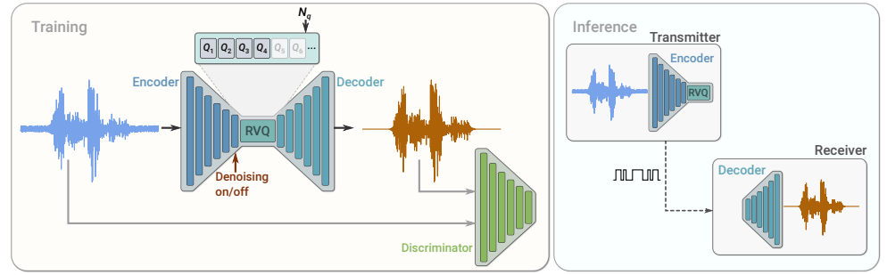

# SoundStream: An Implementation of the End-to-End Neural Audio Codec

This repository presents an implementation of the end-to-end neural audio codec described in the research paper titled "SoundStream: An End-to-End Neural Audio Codec" by Neil Zeghidour, Alejandro Luebs, Ahmed Omran, Jan Skoglund, and Marco Tagliasacchi. The associated research paper can be found here. The implementation utilizes the Zalo AI Challenge Dataset.

<p align="center">
  
</p>

## Dependencies and Acknowledgments
The implementation leverages the Residual Vector Quantizer (RVQ), as introduced by the lucidrains repository. Please ensure that the necessary dependencies are installed before running the code.

## Usage
Before running the main script (main.py), it is essential to unzip the provided dataset, which is packaged in a train.zip file.

## Missing Functionalities
The current implementation lacks certain functionalities, including:

- [ ] __Denoising__: The codec does not support denoising. Consequently, there is no provision for a conditioning signal or the inclusion of Feature-wise Linear Modulation blocks.
- [ ] __Bitrate scalability__: The implementation currently does not incorporate quantizer dropout for bitrate scalability.

## Citations

```bibtex
@misc{zeghidour2021soundstream,
    title   = {SoundStream: An End-to-End Neural Audio Codec},
    author  = {Neil Zeghidour and Alejandro Luebs and Ahmed Omran and Jan Skoglund and Marco Tagliasacchi},
    year    = {2021},
    eprint  = {2107.03312},
    archivePrefix = {arXiv},
    primaryClass = {cs.SD}
}
```
